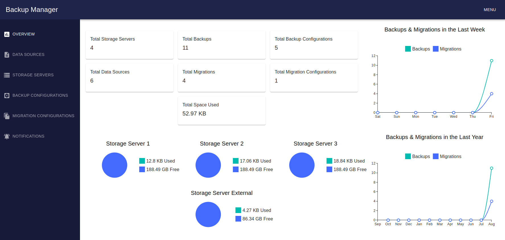
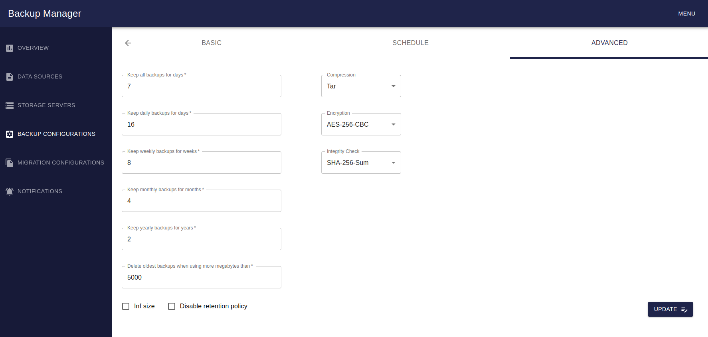

# Backup Manager v1.2.1

## Installation of Backup Manager using backup-manager CLI (tested on Ubuntu/Linux, for other OS, please refer to the [Installation of Backup Manager using docker compose](#installation-of-backup-manager-using-docker-compose-all-os))

### How to install dependencies

1 - [Install docker engine](https://docs.docker.com/engine/install/)

2 - Download backup-manager CLI and add to PATH:

```bash
mkdir -p ~/.local/backup-manager-cli/ && \
cd ~/.local/backup-manager-cli/ && \
curl -o backup-manager https://raw.githubusercontent.com/brayandm/backup-manager/1.2.1/backup-manager.sh && \
chmod +x backup-manager && \
echo "export PATH=\"~/.local/backup-manager-cli/:\$PATH\"" >> ~/.bashrc && \
source ~/.bashrc
```

### How to install

```bash
backup-manager install 1.2.1
```

### How to start

```bash
backup-manager start
```

### How to open (browser)

```bash
backup-manager open
```

### How to stop

```bash
backup-manager stop
```

### How to uninstall

```bash
backup-manager uninstall
```

### How to update to this version (keeping the data)

```bash
backup-manager update 1.2.1
```

### How to check the current version

```bash
backup-manager version
```

## Installation of Backup Manager using docker compose (all OS)

### How to install dependencies

1 - [Install docker engine](https://docs.docker.com/engine/install/)

2 - Download docker-compose.yml:

```bash
mkdir -p ~/.local/backup-manager/ && \
cd ~/.local/backup-manager/ && \
echo 1.2.1 > VERSION && \
curl -o docker-compose.yml https://raw.githubusercontent.com/brayandm/backup-manager/1.2.1/docker-compose.yml
```

### How to start

```bash
cd ~/.local/backup-manager/ && \
APP_PORT=<YOUR_CUSTOM_PORT> VERSION=1.2.1 docker compose up -d
```

### How to open (browser)

```bash
open http://localhost:<YOUR_CUSTOM_PORT>
```

### How to stop

```bash
cd ~/.local/backup-manager/ && \
docker compose down --remove-orphans
```

### How to uninstall

```bash
cd ~/.local/backup-manager/ && \
VERSION=$(cat VERSION) && \
VERSION=VERSION docker compose down --volumes --remove-orphans --rmi all && \
cd ~/.local/ && \
rm -rf backup-manager/
```

### How to update to this version (keeping the data)

```bash
cd ~/.local/backup-manager/ && \
VERSION=$(cat VERSION) && \
VERSION=VERSION docker compose down --remove-orphans --rmi all && \
cd ~/.local/ && \
rm -rf backup-manager/ && \
mkdir -p ~/.local/backup-manager/ && \
cd ~/.local/backup-manager/ && \
echo 1.2.1 > VERSION && \
curl -o docker-compose.yml https://raw.githubusercontent.com/brayandm/backup-manager/1.2.1/docker-compose.yml
```

## Screenshots

### Overview



### Backup configuration



## Features

-   OS compatibility:
    -   for use:
        -   [x] All OS that supports docker engine
    -   for storage servers, intermediate servers and data sources:
        -   [x] Linux
-   Overview:

    -   [x] Metrics about backups and migrations
    -   [x] Amount of backups and migrations per week and year
    -   [x] Free and used space in storage servers

-   Setup data sources:
    -   [x] Folder
    -   [x] File
    -   Database:
        -   [x] MySQL
        -   [x] PostgreSQL
    -   [x] AWS S3
-   Setup storage servers:
    -   [x] AWS S3
    -   [x] Normal server
-   Connections Chainings:
    -   [x] SSH
    -   [x] Docker container
-   Backup configuration:
    -   [x] Multiple data sources and storage servers
    -   [x] Backup schedule
    -   [x] Backup policy retention
    -   [x] Backup compression
    -   [x] Backup encryption
    -   [x] Backup integrity check
    -   [x] Backup monitoring
-   Migration configuration:
    -   [x] Multiple data sources
    -   [x] Migration schedule
    -   [x] Migration compression
    -   [x] Migration monitoring
-   Notifications:
    -   [x] Telegram
-   Authentication:
    -   [x] JWT
    -   [x] One admin user

## For developers

### Setup git hooks

```bash
cp .hooks/* .git/hooks/
```

### How to build docker images

```bash
bash build.sh
```

### How to generate a readme file using the template in /templates folder

```bash
bash genreadme.sh
```

### How to generate a new version x.x.x

```bash
bash versionate.sh
```
